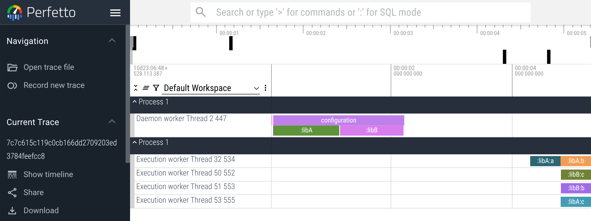

# Gradle tracing plugin using androidx.tracing library

Apply
```kotlin
plugins {
    id("net.liutikas.tracing") version "0.0.1"
}
```

Run some tasks.

Open the generated trace under `trace/TIMESTAMP/merged.zip` in ui.perfetto.dev


